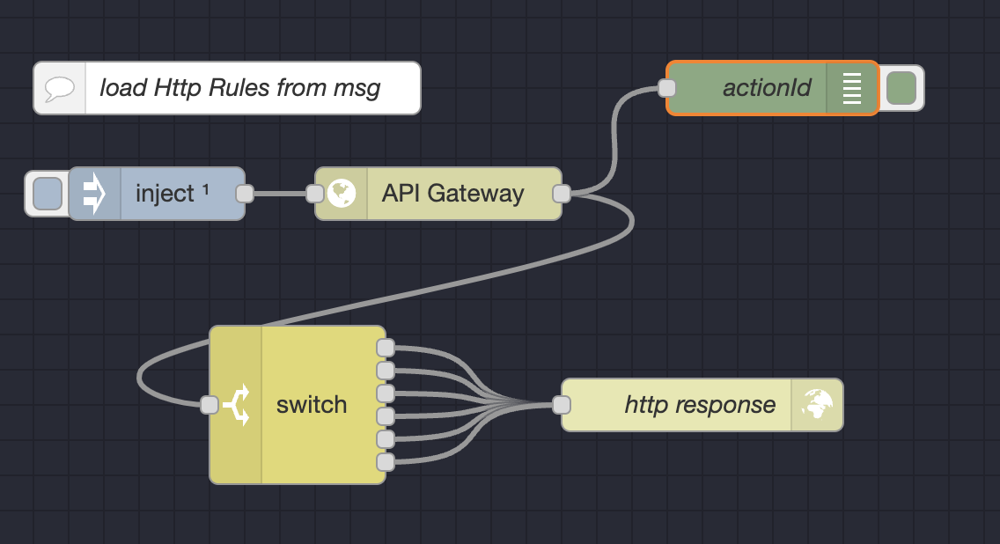
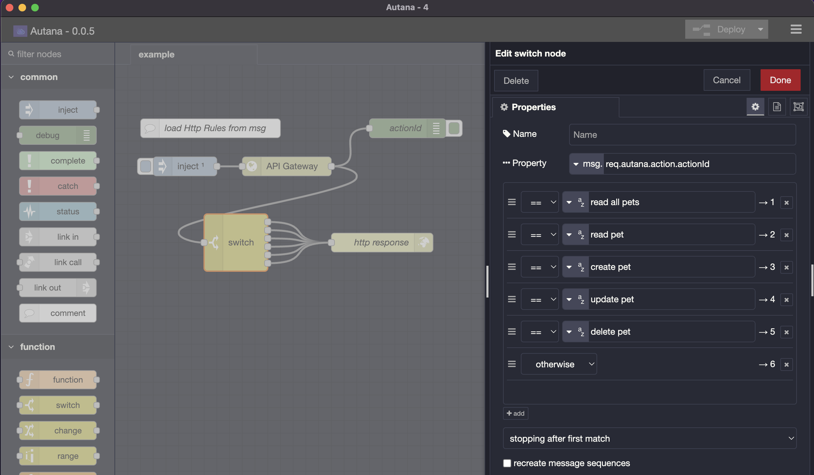

autana-api-gateway
=====================

A minimalist API-Gateway for Node-RED

## Install

Run the following command in your Node-RED user directory - typically `~/.node-red`

        npm install autana-api-gateway

## Information
   
Before use API Gateway, first configure the rules sending a <code>msg.payload</code> with a JSON like this:

```json
{
   "GET": {
      "/pets/": {
         "actionId": "read all pets"
      },
      "/pets/:petId": {
         "actionId": "read pet"
      }
   },
   "POST": {
      "/pets/": {
         "actionId": "create pet"
      },
      "/pets/:petId": {
         "actionId": "update pet"
      }
   },
   "DELETE": {
      "/pets/:petId": {
         "actionId": "delete pet"
      }
   }
}
```

The output <code>msg.req</code> contains an <code>autana</code> object like 
this:

<code>msg.req.autana</code> =
```json
{
   "method": "POST",
   "route": "/pets/:petId",
   "url": "/pets/123",
   "pathParams": {
      "petId": "123"
   },
   "queryParams": {},
   "action": {
      "actionId": "update pet"
   }
}
```

Then You can take an action filtering by <code>msg.req.autana.action.actionId</code>





## Remarks

In your main flow, you must connect a <code>http response</code> node as the end of your flow.

## Extension

You can add more information to the <code>action</code> when configuring:

Example: Add anActionField, anotherActionField and persistence to the action "read all pets"

```json
{
   "GET": {
      "/pets/": {
         "actionId": "read all pets",
         "anActionField": "foo",
         "anotherActionField": "bar",
         "persistence": {
            "table": "dbo.pets"
         }
      },
      "/pets/:petId": {
         "actionId": "read pet"
      }
   }
}
```

When receiving a GET to /pets/, <code>msg.req.autana.action</code> will contain this:

```json
{
   "actionId": "read all pets",
   "anActionField": "foo",
   "anotherActionField": "bar",
   "persistence": {
      "table": "dbo.pets"
   }
}
```